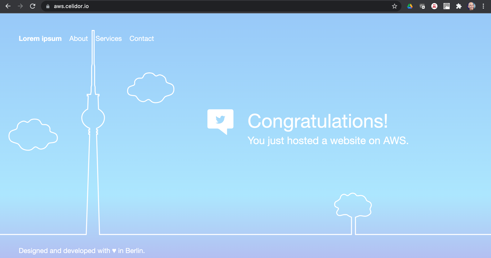
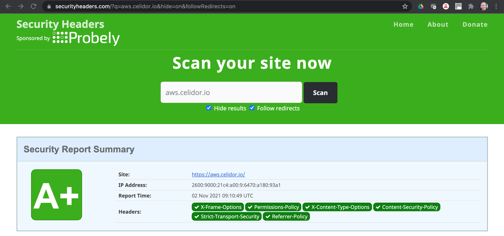

# aws-cloudfront

* S3 bucket with sample web site
* Route53 DNS CNAME
* Certificate Manager
* CloudFront Distribution
* CloudFront Origin Access Control
* S3 bucket policy to only allow access to CloudFront 
* CloudFront custom security header policy





## usage
* duplicate `backend.tf.example` and `terraform.tfvars.example`
* rename without the `example` suffix
* enter details for your environment
* the base_domain must correspond to a Route53 hosted zone in your AWS account
```
terraform init
terraform workspace new dev
terraform plan
terraform apply
```
